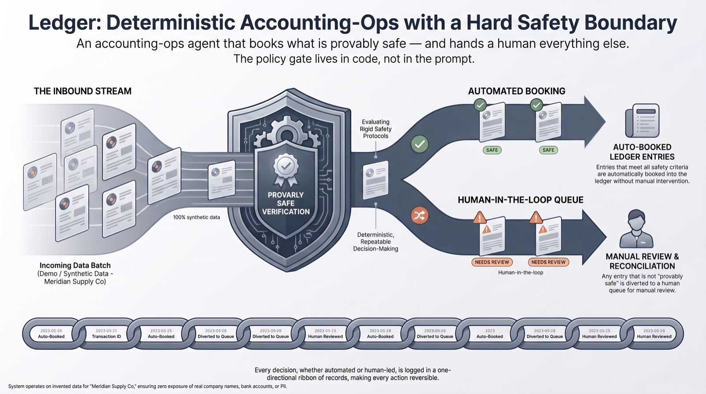
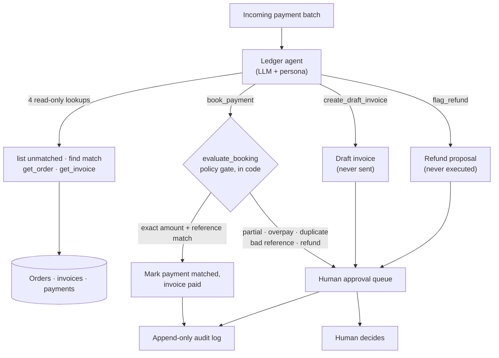

# Ledger

**An accounting-ops agent that books what is provably safe and hands a human everything else. The policy gate lives in code, not in the prompt.**

**[▶ Watch it close yesterday's books, live](#demos)** · one command, eight payments: four auto-booked (including a USD FX reconcile), four refused with reasons, full audit trail printed.

-6e40c9)  

> **What this proves:** an LLM agent runs the full daily close, but a single in-code function (not the prompt) decides every booking, the write surface has zero tools that can move money, and every decision lands in an append-only audit log. Nine of its eleven policy verdicts are pinned as named branches by the test suite.

## What it is

Ledger is an AI agent that closes the daily books for a small e-commerce shop. Given a batch of incoming bank payments, it reconciles each one against the open orders and invoices through a set of typed tools, books only the payments that pass a deterministic policy gate, and routes everything else to a human queue with the reason attached. Every write it makes is appended to an audit log.

The design point is the boundary, not the automation. The model drives the workflow, but it cannot book a payment, send a document, or move money by talking its way past the rules: the decision to book is made by a single function in code that the agent can only call, never override.

## What is real and what is fiction

Being explicit about this, because a bookkeeping demo lives or dies on trust:

**Real (working code you can run):**
- The MCP server and its ten typed tools.
- The policy engine in `store.py::evaluate_booking`: one choke point, deterministic branches, one verdict per payment.
- The append-only audit log and the human approval queue.
- The end-to-end test suite that pins every policy branch.

**Fiction (nothing here touches a real ledger):**
- The company (Meridian Supply Co., an outdoor-gear shop), its customers, orders, invoices, and the whole payment batch are generated synthetically by `generate_data.py`. Dates are stamped relative to today, so "close yesterday's books" resolves on any day.
- No bank, no accounting system, and no money are connected. The worst the agent can do is mislabel an internal JSON record, which the audit log captures and a human reverses.

This is a sanitized, synthetic-data demo of a bookkeeping automation I run in production against my own company's books. It runs on invented data (Meridian Supply Co.) so the design and the guardrails are fully on display with nothing real exposed. It is deliberately not framed as banking or regulated finance: it is bookkeeping-ops with a hard capability boundary.

## Demos

Recorded live against the running system. No mockups.

https://github.com/user-attachments/assets/b6d84570-0d60-4636-b906-fbd26feffc5a

**What to watch:** one command closes the day. The agent works the batch of eight payments, auto-books the four that are safe (three exact EUR matches plus one USD payment that reconciles only after a visible daily-rate conversion), refuses the four that are not, and prints its full audit trail: every action, every decision, every refusal with a reason.

https://github.com/user-attachments/assets/ee688cb3-f16b-4245-92c9-6f3d1621c593

**What to watch:** the approval queue. A partial payment (250 of 495 EUR due) is refused, not squeezed through. A second payment against an already-paid invoice is flagged as a likely duplicate with a refund *proposed, never executed*. An unreadable reference is escalated for research. The agent ends on the point that every open item needs a human, because no tool in the system can send a document or move money.

## How it works

The architecture is a short list of design decisions, each aimed at a specific failure mode.

**The policy gate is code, not prompt.** Whether a payment may auto-book is decided by `evaluate_booking()`, a single deterministic function. It is the only path to a booking. The agent chooses which payment and invoice to test; the function returns the verdict, and the tool reports it verbatim. A cleverly worded request cannot change the outcome, because the outcome is not the model's to make.

**Auto-book has a narrow, explicit definition.** A payment books automatically only when the reference names the invoice or its order **and** the amount matches exactly (tolerance 0.01 EUR). Non-EUR payments convert at a fixed daily rate and auto-book only within 0.5 percent of the amount due, with the conversion written into the audit note. Everything outside that window (partial payments, overpayments, duplicates of paid invoices, unmatchable references, negative amounts) is refused and queued.

**The write surface is a capability boundary.** There are exactly four write tools, and none of them sends a document, emails a customer, or transfers funds. A refund is a proposal (`flag_refund`, `executed: false`). A new invoice is a draft (`create_draft_invoice`, `status: draft`, and a draft cannot be booked against). Booking only flips internal record state after the gate passes. The system has no tool that could move money, so no prompt can make it.

**Every write is audited and reconciled.** Each booking, refusal, draft, refund proposal, and escalation appends an entry to an audit log with the actor, the decision code, the reason, and the references touched. The daily close reports it back in full, so the trail is a first-class output, not a hidden side effect.

**Ambiguity is a routing decision, not a guess.** When the agent cannot safely book, the answer is not a best-effort booking. It is an item in the human queue with a machine-readable reason code and a plain-language explanation.

## Stack

- **Python** for the whole system.
- **FastMCP server** (`mcp_server.py`) exposing ten typed tools over streamable-http: six read-only lookups (`list_unmatched_payments`, `find_matching_invoice`, `get_order`, `get_invoice`, `list_pending_approvals`, `get_audit_log`) and four policy-gated writes (`book_payment`, `create_draft_invoice`, `flag_refund`, `escalate_payment`).
- **Policy engine** (`store.py`) holding `evaluate_booking`, the single booking choke point, plus the audit log and approval queue as append-only JSON state.
- **Synthetic data generator** (`generate_data.py`) that rebuilds a pristine, date-relative fixture, so any run starts clean and "yesterday" always resolves.
- **Agent persona / system prompt** (`system_prompt.md`) that instructs the model to reconcile, book what the server allows, and escalate the rest with reasons. It has no authority over the policy gate; at most it wastes a tool call.
- **Recording front end:** a rebranded open-source LibreChat build, used only to film the demo. It is disposable. The durable engineering is the server, the gate, and the audit trail, and the agent runs over any MCP-capable client.

## Correctness

Because the policy gate is deterministic, correctness here means pinning every hazard branch, not measuring a distribution. `test_flow.py` is that check: it isolates each hazard in a throwaway temp directory (so a run never touches the demo `state/` fixture), rebuilds fresh state, runs the exact flow the agent runs on camera, asserts one outcome per hazard, and exits non-zero on any drift.

| Hazard in the batch | Policy verdict | What the agent does |
|---|---|---|
| Exact EUR amount + matching reference (x3) | `EXACT_MATCH` | Auto-books, audited |
| USD payment, correct after daily-rate conversion | `FX_MATCH` (within 0.5%) | Auto-books, conversion written to the audit note |
| Partial payment (250 of 495 EUR due) | `PARTIAL_PAYMENT` | Refused, escalated to a human |
| Second payment against an already-paid invoice | `INVOICE_ALREADY_PAID` | Refused, refund proposed (never executed) |
| Unreadable reference, no confident match | escalation | Escalated for research |
| Payment for an order with no invoice yet | draft created, then `DRAFT_INVOICE` | Drafts the invoice, holds; a draft cannot be booked against |
| Re-booking an already-matched payment | `ALREADY_MATCHED` | Refused (idempotency) |

Latent branches the engine also enforces and the suite guards against by construction: overpayment (`OVERPAYMENT`), a currency with no configured rate (`NO_FX_RATE`), and any negative amount (`REFUND_REQUIRES_HUMAN`). The value is that each of these is a named, tested branch rather than a behavior that happens to hold today.

## How it is built

I work AI-first: I direct tools like Claude Code to generate and refactor the implementation, and I own the parts that decide whether it is safe to ship, which here are the policy boundary, the capability limits, and the failure modes each guardrail is meant to catch.

## Status and contact

**Runnable demo of a system I run in production.** Synthetic data, real engineering. It is one instance of a pattern I reuse across systems: an agent gets typed, allowlisted tools; a guardrail in code (not the prompt) gates every state change; and anything consequential waits for a human.

- More systems and the shared architecture: [github.com/janvrsinsky](https://github.com/janvrsinsky)
- LinkedIn: [linkedin.com/in/janvrsinsky](https://linkedin.com/in/janvrsinsky)
