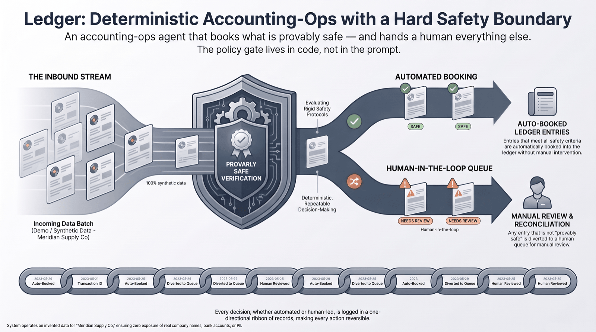
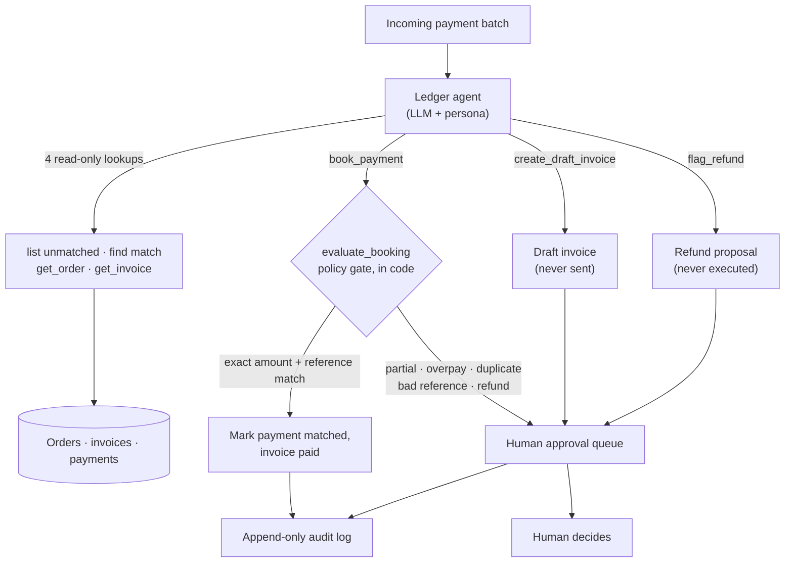

# Ledger

**An accounting-ops agent that books what is provably safe and hands a human everything else. The decision to book is made by a deterministic function in code.**

**Portfolio exhibit.** This is a sanitized public extract of a private system in daily use. The architecture and method are real; the data and identifiers are stand-ins, and the section below lists which is which.

**[▶ Watch it close yesterday's books, live](#demos)**

[](https://github.com/janvrsinsky/jv-ledger-agent/actions/workflows/ci.yml)


## What it does

Ledger closes the daily books for a small e-commerce shop. Given a batch of incoming bank payments, it reconciles each one against open orders and invoices through ten typed MCP tools, books only the payments that pass a deterministic policy gate, and routes everything else to a human queue with the reason attached. Every write is appended to an audit log.

## What is real and what is fiction

**Real (working code you can run):**

- The MCP server and its ten typed tools.
- The policy engine in `store.py::evaluate_booking`: one choke point, deterministic branches, one verdict per payment.
- The append-only audit log and the human approval queue.
- The end-to-end test suite that pins every policy branch.

**Fiction (nothing here touches a real ledger):**

- The company (Meridian Supply Co., an outdoor-gear shop), its customers, orders, invoices, and the whole payment batch come from `generate_data.py`. Dates are stamped relative to today, so "close yesterday's books" resolves on any day.
- No bank, no accounting system, and no money are connected. The worst possible failure is a mislabeled internal JSON record, captured by the audit log and reversed by a human.

The private original runs against my own company's books. This extract runs on invented data so the guardrails are fully on display with nothing real exposed. It is bookkeeping ops and claims no banking or regulated-finance scope.

## Demos

Recorded live against the running system. No mockups.

https://github.com/user-attachments/assets/b6d84570-0d60-4636-b906-fbd26feffc5a

One command closes the day: four of eight payments auto-book (three exact EUR matches plus one USD payment reconciled at the daily rate), four are refused, and the full audit trail prints with a reason for every decision.

https://github.com/user-attachments/assets/ee688cb3-f16b-4245-92c9-6f3d1621c593

The approval queue: a partial payment (250 of 495 EUR due) is refused, a second payment against an already-paid invoice is flagged as a likely duplicate with a refund proposed and never executed, and an unreadable reference is escalated for research. Every open item ends with a human, because no tool in the system can send a document or move money.

## How it works

- **Policy gate in code.** `evaluate_booking()` is the only path to a booking. The agent picks which payment and invoice to test; the function returns the verdict and the tool reports it verbatim. No wording of a request changes the outcome.
- **Narrow auto-book definition.** A payment books automatically only when the reference names the invoice or its order **and** the amount matches exactly (tolerance 0.01 EUR). Non-EUR payments convert at a fixed daily rate and auto-book only within 0.5 percent of the amount due, with the conversion written into the audit note. Partial payments, overpayments, duplicates of paid invoices, unmatchable references, and negative amounts are refused and queued.
- **Capability-bounded write surface.** Four write tools; none sends a document, emails a customer, or transfers funds. A refund is a proposal (`flag_refund`, `executed: false`). A new invoice is a draft (`create_draft_invoice`, `status: draft`, and a draft cannot be booked against). Booking flips internal record state only after the gate passes. The system has no tool that could move money, so no prompt can make it.
- **Everything audited.** Each booking, refusal, draft, refund proposal, and escalation appends an entry with the actor, the decision code, the reason, and the references touched. The daily close reports the trail in full.
- **Ambiguity routes to a human** as a queue item with a machine-readable reason code and a plain-language explanation.


```mermaid
flowchart TB
    BATCH["Incoming payment batch"] --> AGENT["Ledger agent<br/>(LLM + persona)"]
    AGENT -->|"4 read-only lookups"| READ["list unmatched · find match<br/>get_order · get_invoice"]
    READ --> SOR[("Orders · invoices · payments")]
    AGENT -->|"book_payment"| GATE{"evaluate_booking<br/>policy gate, in code"}
    GATE -->|"exact amount + reference match"| BOOK["Mark payment matched,<br/>invoice paid"]
    GATE -->|"partial · overpay · duplicate<br/>bad reference · refund"| QUEUE["Human approval queue"]
    AGENT -->|"create_draft_invoice"| DRAFT["Draft invoice<br/>(never sent)"] --> QUEUE
    AGENT -->|"flag_refund"| PROP["Refund proposal<br/>(never executed)"] --> QUEUE
    BOOK --> AUDIT["Append-only audit log"]
    QUEUE --> AUDIT
    QUEUE --> HUMAN["Human decides"]
```

## Run it

```sh
pip install -r requirements.txt   # fastmcp, needed by the server only
python generate_data.py           # rebuild the pristine, date-relative fixture
python mcp_server.py              # typed tools over streamable-http on 127.0.0.1:8766
```

Point any MCP-capable client at the server with `system_prompt.md` as the agent persona. The persona has no authority over the gate; at most it wastes a tool call. The demo front end is a rebranded open-source LibreChat build, used only for filming.

Six read-only lookups: `list_unmatched_payments`, `find_matching_invoice`, `get_order`, `get_invoice`, `list_pending_approvals`, `get_audit_log`. Four policy-gated writes: `book_payment`, `create_draft_invoice`, `flag_refund`, `escalate_payment`.

## Correctness

The gate is deterministic, so correctness here means pinning every hazard branch; nine of the eleven policy verdicts are pinned as named branches by the test suite. `test_flow.py` isolates each hazard in a throwaway temp directory (a run never touches the demo `state/` fixture), rebuilds fresh state, runs the exact flow filmed above, asserts one outcome per hazard, and exits non-zero on any drift. It runs on the standard library alone (`python test_flow.py`); GitHub Actions runs it on every push, and the badge at the top is that gate.

| Hazard in the batch | Policy verdict | What the agent does |
|---|---|---|
| Exact EUR amount + matching reference (x3) | `EXACT_MATCH` | Auto-books, audited |
| USD payment, correct after daily-rate conversion | `FX_MATCH` (within 0.5%) | Auto-books, conversion written to the audit note |
| Partial payment (250 of 495 EUR due) | `PARTIAL_PAYMENT` | Refused, escalated to a human |
| Second payment against an already-paid invoice | `INVOICE_ALREADY_PAID` | Refused, refund proposed (never executed) |
| Unreadable reference, no confident match | escalation | Escalated for research |
| Payment for an order with no invoice yet | draft created, then `DRAFT_INVOICE` | Drafts the invoice, holds; a draft cannot be booked against |
| Re-booking an already-matched payment | `ALREADY_MATCHED` | Refused (idempotency) |

Latent branches the engine also enforces and the suite guards: overpayment (`OVERPAYMENT`), a currency with no configured rate (`NO_FX_RATE`), and any negative amount (`REFUND_REQUIRES_HUMAN`). Each is a named, tested branch.

## Status and contact

**PRODUCTION EXTRACT.** A sanitized public cut of a private system in real use. The architecture and method are real; data, names and some components are stand-ins, and the README lists which is which. The pattern repeats across my systems: typed, allowlisted tools; a guardrail in code gating every state change; a human before anything consequential. I direct AI coding tools to build it; the policy boundary, the capability limits, and the failure modes are mine.

- More systems and the shared architecture: [github.com/janvrsinsky](https://github.com/janvrsinsky)
- LinkedIn: [linkedin.com/in/janvrsinsky](https://linkedin.com/in/janvrsinsky)

## Topics


-6e40c9)


